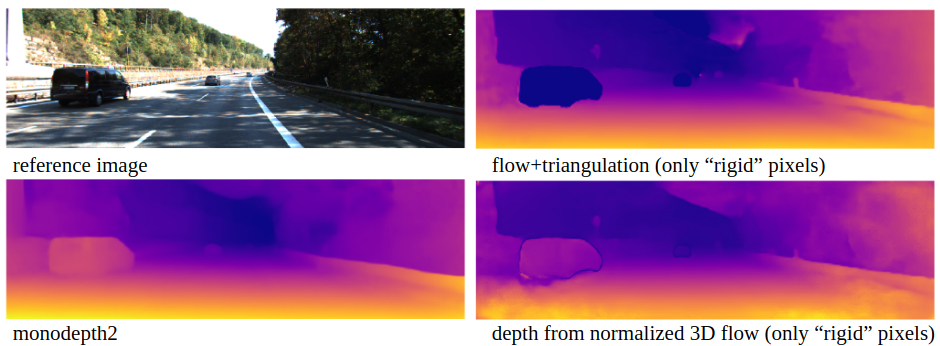
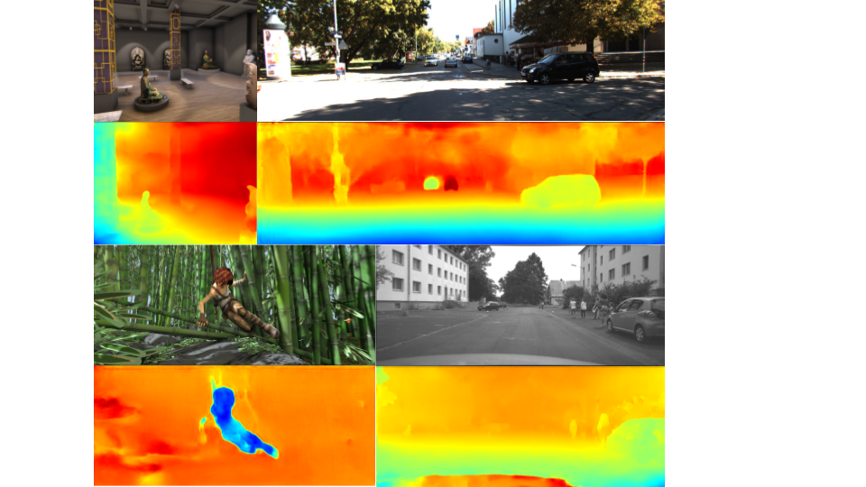
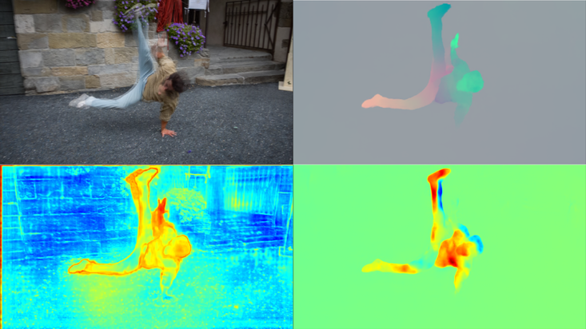

# Optical Expansion
[[project website]](http://www.contrib.andrew.cmu.edu/~gengshay/cvpr20expansion.html)

<p align="center">
  
</p>

If you find this work useful, please consider citing our paper:
```
@inproceedings{yang2020upgrading,
  title={Upgrading Optical Flow to 3D Scene Flow through Optical Expansion},
  author={Yang, Gengshan and Ramanan, Deva},
  booktitle={Proceedings of the IEEE/CVF Conference on Computer Vision and Pattern Recognition},
  pages={1334--1343},
  year={2020}
}
```

**Requirement**
- python3
- opencv
- pytorch 1.2.0 (may also be compatible with other versions)
- tensorboard (only for training)

**Useful tools** (optional)
- [gdown](https://github.com/wkentaro/gdown) for downloading from google drive
- [cvkit](https://github.com/roboception/cvkit) for visualizing .pfm files


## Precomputed results
We provide precomputed optical flow, optical expansion, and monocular depth (from [monodepth2](https://github.com/nianticlabs/monodepth2)) for kitti sceneflow training set (equiv. to ours train+val). 
This should produce monocular scene flow results very close to Tab.1.

It also includes precomputed results for Tab. 3 lidar scene flow.
```
gdown https://drive.google.com/uc?id=1mNRuEHwMEo0HE6oR3ZY1S1u9_NE4WjfT -O ./precomputed.zip
      
unzip precomputed.zip
```
See demo-expansion.ipynb and lidar-scene-flow.ipynb for more details.

## *Rigid* depth inference
We provide the script to compute (1) depth from flow triangulation and (2) depth from normalized 3D flow. This corresponds to Sec. 4.5 rigid depth estimation in the paper, and produces the following result.
Precomputed camera poses on KITTI sceneflow training set is included in precomputed.zip.

<p align="center">
  

See demo-expansion.ipynb for more details.

## Inference

### Pretrained models
Download pre-trained models to `./weights` (assuming gdown is installed, ~50MB each),
```
mkdir weights
mkdir weights/exp-driving
mkdir weights/exp-kitti-train
mkdir weights/exp-kitti-trainval
mkdir weights/robust
gdown https://drive.google.com/uc?id=1KMEqXlisLgK4n9alWRbgIWch7TTye56u -O ./weights/exp-driving/exp-driving.pth
gdown https://drive.google.com/uc?id=1ZjPc7P743R3b_5MbBbU_VpUMULYo-SWk -O ./weights/exp-kitti-train/exp-kitti-train.pth
gdown https://drive.google.com/uc?id=11Cf3NxbzGq2rdwdI2_HuQDlwIWNWMu7u -O ./weights/exp-kitti-trainval/exp-kitti-trainval.pth
gdown https://drive.google.com/uc?id=1591sjVSt_ppHqmQ-59Tirw_SozjgeM8D -O ./weights/robust/robust.pth
```

|modelname | training-set | flow-basemodel | flow-error (Fl-err/EPE)  | expansion-error (1e4) | motion-in-depth-error (1e4)|
|---|---:|---:|---:|---:|---:|
|[exp-driving](https://drive.google.com/uc?id=1KMEqXlisLgK4n9alWRbgIWch7TTye56u)        | Driving                   | flow-things          | 25.5%/8.874px   | 234.8 | 172.4 |
|[exp-kitti-train](https://drive.google.com/uc?id=1ZjPc7P743R3b_5MbBbU_VpUMULYo-SWk)    | Driving->KITTI-train      | flow-kitti-train     | 6.0%/1.644px    | 107.3 | 73.6  |
|[exp-kitti-trainval](https://drive.google.com/uc?id=11Cf3NxbzGq2rdwdI2_HuQDlwIWNWMu7u) | Driving->KITTI-trainval   | flow-kitti-trainval  | 3.9%/1.144px    | 87.5  | 52.2  |
|[robust](https://drive.google.com/uc?id=1591sjVSt_ppHqmQ-59Tirw_SozjgeM8D)             | TMDKSGV                   | CTMDKSHG             | 9.3%/3.366px    | 83.1  | 55.7  |

** The "robust" model is trained on a mixture of datasets, aiming for improved cross-dataset generalization ability, see [robust vision challenge](http://www.robustvision.net/index.php).
C: Chairs, T: Things, M: Monkaa, D: Driving, K: our KITTI training set, S: our Sintel training set, H: HD1K, G: GTAV (not released)

### Try on a video sequence (>=2 frames)
<p align="center">
  

Top: reference images; Bottom: mition-in-depth estimations (with kitti-finetuned model)
</p>

<p align="center">
  

Top left: overlaid two frames; Top right: flow; Bottom left: uncertainty; Bottom right: mition-in-depth (robust model)
</p>

Run for [KITTI](http://www.cvlibs.net/datasets/kitti/) sequence,
```
modelname=exp-kitti-trainval
CUDA_VISIBLE_DEVICES=0 python submission.py --dataset seq  --datapath ./input/kitti_2011_09_30_drive_0028_sync_11xx   --outdir ./weights/$modelname/ --loadmodel ./weights/$modelname/$modelname.pth  --testres 1 --fac 2 --maxdisp 512
```
Run for [Blackbird](https://github.com/mit-fast/Blackbird-Dataset) sequence,
```
modelname=exp-kitti-trainval
CUDA_VISIBLE_DEVICES=0 python submission.py --dataset seq  --datapath ./input/blackbird   --outdir ./weights/$modelname/ --loadmodel ./weights/$modelname/$modelname.pth  --testres 1 --fac 2 --maxdisp 512
```
Run for [HD1K](http://hci-benchmark.iwr.uni-heidelberg.de/),
```
modelname=exp-kitti-trainval
CUDA_VISIBLE_DEVICES=1 python submission.py --dataset seq  --datapath ./input/HD1K_000000_001x/   --outdir ./weights/$modelname/ --loadmodel ./weights/$modelname/$modelname.pth  --testres 1 --fac 2 --maxdisp 512
```
Run for [Sintel](http://sintel.is.tue.mpg.de/downloads),
```
modelname=exp-kitti-trainval
CUDA_VISIBLE_DEVICES=1 python submission.py --dataset seq  --datapath ./input/Sintel/   --outdir ./weights/$modelname/ --loadmodel ./weights/$modelname/$modelname.pth  --testres 1 --fac 2 --maxdisp 512
```
Run the robust model on [DAVIS](https://davischallenge.org/index.html),
```
modelname=robust
CUDA_VISIBLE_DEVICES=1 python submission.py --dataset seq  --datapath ./input/DAVIS/   --outdir ./weights/$modelname/ --loadmodel ./weights/$modelname/$modelname.pth  --testres 1 --fac 1 --maxdisp 256
```

Results will be saved to `./weights/$modelname/seq/` in `.pfm` format.

Assuming cvkit is already installed, to visualize motion-in-depth `log(d2/d1)`,
```
sv weights/$modelname/seq/mid*
```
To visualize optical expansion,
```
sv weights/$modelname/seq/exp*
```
To visualize optical flow,
```
sv weights/$modelname/seq/flo*
```
To visualize occlusion estimation (current occlusion prediction modules gives wrong results, will release the correct ones soon),
```
sv weights/$modelname/seq/occ*
```
### Evaluate on KITTI
Download [KITTI-sceneflow](http://www.cvlibs.net/datasets/kitti/eval_scene_flow.php) dataset, our [expansion extension](https://drive.google.com/file/d/1Sad7uItHZT4Lj8uIVt4PoePOqfLfenNP/view?usp=sharing), and run
```
bash run_eval.sh
```
and results will be saved to `./weights/$modelname/2015val`. 
It also computes error on our KITTI val set (ID 0,5,10,...195). 
To run this script, you'll need to point $datapath to `kitti-sceneflow-path/`.

To estimte optical flow and motion-in-depth on KITTI sceneflow test set, run
```
bash run_test.sh
```
and results will be saved to `./weights/$modelname/2015test`.

### Compute scene flow (2nd frame depth) from expansion
Simply do `d2 = d1/tau`, where `d1` is the first frame disparity and `tau` is the motion-in-depth. 

See demo.ipynb for a detailed walk-through of producing monocular scene flow results on KITTI.

## Training
**Note on flow backbone** 

This repo currently does not support training of optical flow. However, we provide pre-trained VCN models below. 
If you would like to pre-train VCN on other datasets, please use [VCN](https://github.com/gengshan-y/VCN) repo instead.
If you plan to swith to other flow backbones, modify models/VCN_exp.py L489-L513 accordingly.

**Datasets**
- Download the clean-pass, optical flow, disparity, and disparity change of Driving from [SceneFlow](https://lmb.informatik.uni-freiburg.de/resources/datasets/SceneFlowDatasets.en.html)
- [KITTI scene flow dataset](http://www.cvlibs.net/datasets/kitti/eval_scene_flow.php)

**Pre-trained optical flow models**

Download pre-trained VCN models,

|modelname | training-set | KITTI flow-error (Fl-err/EPE)|
|---|---:|---:|
|[flow-things](https://drive.google.com/uc?id=199XJnohshP4L4R0mlgrM2teuo_Q4Npy3)      | C(hairs)->T(hings)    | 25.5%/8.874px  |
|[flow-kitti-train](https://drive.google.com/uc?id=1w4_OJ4jfkPf7UYk21bmDq__8cVzMsjZq) | C->T->K(ITTI)train | 6.0%/1.644px  |
|[flow-kitti-trainval](https://drive.google.com/uc?id=1kEqyP0CmNFx7EnzqGt_jkRYRxloIHheT) | C->T->Ktrainval | 3.9%/1.144px  |

### Train on Synthetic datasets
The following command freezes the pre-trained optical flow model and trains optical expansion on Driving for 40k iterations (taking ~9h on a TitanXp GPU).
```
CUDA_VISIBLE_DEVICES=0 python main.py --logname exp-d-1 --database data-path --savemodel save-path --loadflow path-to-pretrained-weights/weights/flow-things.pth.tar
```
### Fine-tune on domain specific datasets (KITTI)
The following command freezes the pre-trained optical flow model and fine-tunes optical expansion on KITTI train set for 20k iterations.
```
CUDA_VISIBLE_DEVICES=0 python main.py --logname exp-kt-1 --database data-path --savemodel save-path --loadmodel path-to-pretrained-weights/weights/exp-driving.pth --loadflow path-to-pretrained-weights/weights/flow-kitti-train.pth.tar --niter 20000 --stage expansion2015train
```
The following command freezes the pre-trained optical flow model and fine-tunes optical expansion on KITTI train+val set for 20k iterations.
```
CUDA_VISIBLE_DEVICES=0 python main.py --logname exp-kt-1 --database data-path --savemodel save-path --loadmodel path-to-pretrained-weights/weights/exp-driving.pth --loadflow path-to-pretrained-weights/weights/flow-kitti-trainval.pth.tar --niter 20000 --stage expansion2015v
```
